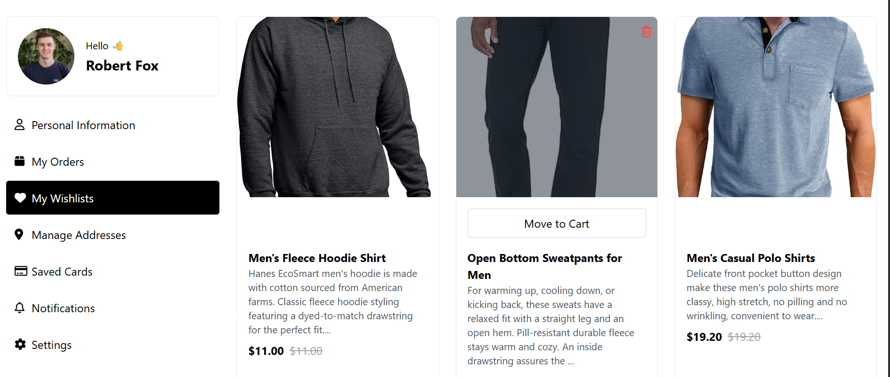

# E-Commerce Application (Static Page)

This repository contains the source code for a static e-commerce application built using **HTML**, **CSS**, **JavaScript**, and styled with **Tailwind CSS**. The application is a simple, responsive frontend interface designed to showcase products and basic e-commerce functionality.

---

## Features

- **Responsive Design**: Adapts seamlessly to various screen sizes (desktop, tablet, mobile).
- **Dynamic Pagination**: Implements frontend pagination for better navigation through product lists.
- **Interactive UI**: 
  - "Add to Cart" and "Wishlist" buttons with hover effects.
  - Smooth scroll and loading spinner on pagination actions.
- **Tailwind CSS Styling**: Clean and modern UI built with utility-first CSS framework.

---

## Preview

---

## Technologies Used

- **HTML**: Markup for the static pages.
- **Tailwind CSS**: For styling the interface.
- **JavaScript**: Adds interactivity (pagination, hover effects, etc.).
- **Font Awesome**: For icons used in the application.
  
---

